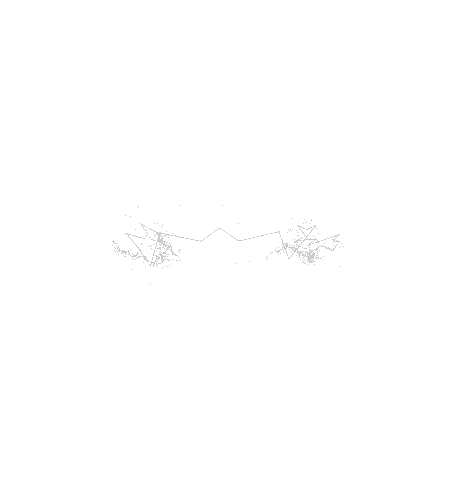

# Fourier-drawing
## Drawing `svg` files with Fourier analysis.

For a given `svg`, you can produce an animation of circles drawing your image. This is all Fourier analysis.

<div align="center">
    
    
</div>

## Usage:

You need to have the proper python packages installed:
```bash
python main.py <INPUT> <N_POINTS> <N_VECTORS> --plot
```
`INPUT` must be in `svg` format. `N_POINTS` is the number of points regularly sampled on the `svg` paths. `N_VECTOR` is the number of vectors used to draw your image with frequencies in `]-N_VECTOR//2, N_VECTOR//2]`.

### Parameters:
  - **--threshold_path_length *THRESHOLD_PATH_LENGTH***:\
        Threshold for path length below which paths are not considered (to avoid artifacts).
  - **--threshold_vectors_module *THRESHOLD_VECTORS_MODULE***:\
        Threshold for vectors module below which vectors are not drawn (for speed and visibility contraints).
  - **--plot**:\
        Plot the animation with matplotlib.
  - **--interval *INTERVAL***:\
        Interval between two frames (in milliseconds).
  - **--step *STEP***:\
        Number of steps between two frames.
  - **-v *VIDEO*** or **--video *VIDEO*** :\
        Generate a video output and saves it at given path.
  - **--fps *FPS***:\
        Frame rate for the generated video.
  - **--codec *CODEC***:\
        Codec for the generated video.
  - **--dpi *DPI***:\
        Dots per inch in the generated video.
  - **--width *WIDTH***:\
        Nb of pixels in width in the generated video.
  - **--height *HEIGHT***:\
        Nb of pixels in height in the generated video.
  - **--background_color *BACKGROUND_COLOR***:\
        Color of the background in hex format (e.g. '#FFFFFF' or None for transparent).
  - **--line_color *LINE_COLOR***:\
        Color of the drawn line in hex format (e.g. '#FFFFFF' or '#FFFFFFFF' with alpha channel).
  - **--line_width *LINE_WIDTH***:\
        Width of the drawn line.
  - **--line_decay *LINE_DECAY***:\
        Decay speed of line opacity.
  - **--circle_color *CIRCLE_COLOR***:\
        Color of the circles in hex format (e.g. '#FFFFFF' or '#FFFFFFFF' with alpha channel).
  - **--circle_width *CIRCLE_WIDTH***:\
        Width of the circles.
  - **--vector_color *VECTOR_COLOR***:\
        Color of the vectors in hex format (e.g. '#FFFFFF' or '#FFFFFFFF' with alpha channel).
  - **--vector_width *VECTOR_WIDTH***:\
        Width of the vectors.


## What to do next
- [ ] Handling multi-color drawings
- [ ] Masking path-linking lines
- [ ] Support for transparent-background GIFs